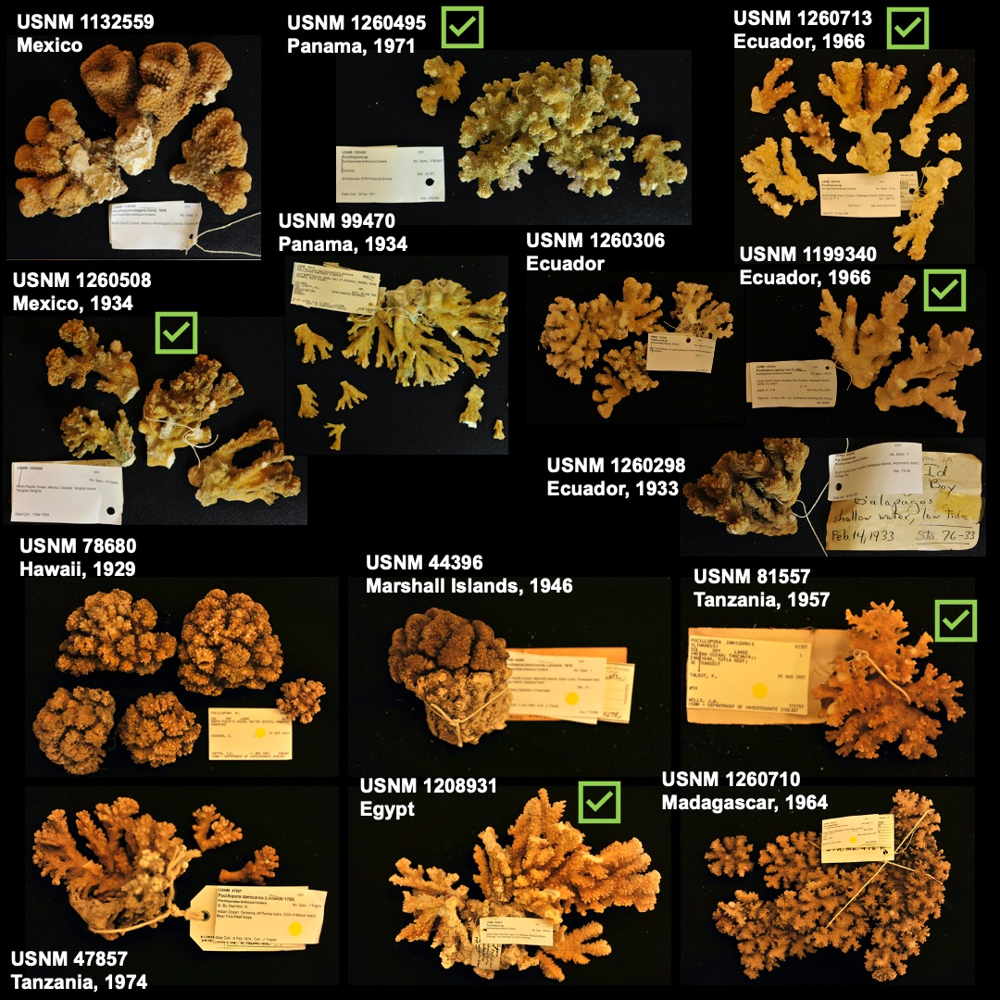

# pocillopora_hDNA_uces

This repository holds the data and code for analysis of historical DNA sequenced from dried *Pocillopora* corals in the Smithsonian National Museum of Natural History dry collections. 

| Specimen No. | Origin                 | Collection Year | 
|--------------|------------------------|-----------------|
| USNM 1260495 | Panama, Islas Perlas   | 1971            |
| USNM 1260508 | Mexico, Oaxaca         | 1934            |
| USNM 1260713 | Ecuador, Galapagos     | 1966            |
| USNM 1260710 | Madagascar             | 1964            |
| USNM 1132559 | Mexico, Revillagigedos |                 |
| USNM 1199340 | Ecuador, Galapagos     | 1966            |
| USNM 1208931 | Egypt, Red Sea         |                 | 
| USNM 1260298 | Ecuador, Galapagos     | 1933            |
| USNM 44396   | Marshall Islands       | 1946            |
| USNM 78680   | Hawaii, Kawaihae       | 1929            |
| USNM 81557   | Tanzania, Zanzibar     | 1957            |
| USNM 99470   | Panama, Islas Secas    | 1934            |

