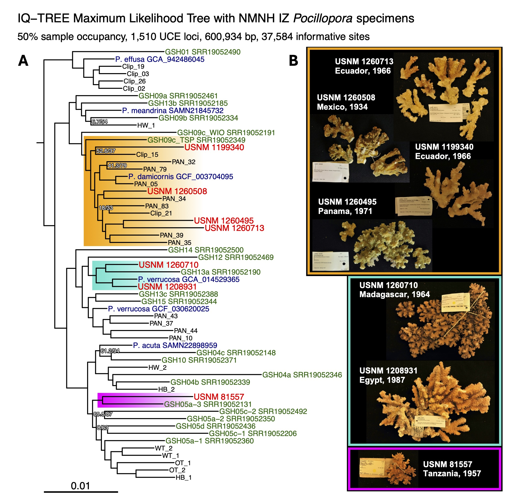

# pocillopora_hDNA_uces

This repository holds the data and code for analysis of historical DNA sequenced from dried *Pocillopora* corals in the Smithsonian National Museum of Natural History dry collections. 

Catalog Number | Origin | Collection Date | Age (years) | UCE loci | GSH | Current Nomenclature |
|--------------|---------|-----------------|-------------|----------|-----|----------------------|
USNM 1260306 | Ecuador | February, 1978 | 46 | 0 | - | - |
USNM 1199340 | Ecuador | May 19, 1966 | 58 | 799 | GSH09c_TSP | *P. grandis* |
USNM 1260713 | Ecuador | September 21, 1966 | 58 | 795 | GSH09c_TSP | *P. grandis* |
USNM 1260298 | Ecuador | February 14, 1933 | 91 | 17 | - | - |
USNM 1208931 | Egypt | June, 1987 | 37 | 1495 | GSH13a | *P. verrucosa* |
USNM 78680 | Hawaii | October 1, 1929 | 95 | 0 | - | - |
USNM 1260710 | Madagascar | October 23, 1964 | 60 | 1173 | GSH13a | *P. verrucosa* |
USNM 44396 | Marshall Islands | June 2, 1946 | 78 | 35 | - | -
USNM 1132559 | Mexico | March 1, 1934 | 90 | 0 | - | - |
USNM 1260508 | Mexico | March 1, 1934 | 90 | 1504 | GSH09c_TSP | *P. grandis* |
USNM 1260495 | Panama | April 30, 1971 | 53 | 814 | GSH09c_TSP | *P. grandis* |
USNM 99470 | Panama | February 22, 1934 | 90 | 0 | - | - |
USNM 47857 | Tanzania | February 6, 1974 | 50 | 0 | - | - |
USNM 81557 | Tanzania | August 16, 1957 | 67 | 327 | GSH05a-3 | *P. acuta* |

For more information on specimens, visit https://collections.nmnh.si.edu/search/iz/

Raw sequencing reads are available in the NCBI SRA under accessions PRJNA1075782 for historical specimens and PRJNA1055517 and PRJNA1076507 for contemporary samples. 

 (A) IQ-TREE maximum likelihood phylogenetic tree depicting the placement of NMNH IZ Pocillopora specimens (in red) in the context of publicly available reference genomes (in blue), genomic species hypotheses (GSHs) sensu Oury et al. 2023 (in green), and contemporary specimens. Nodes with <90% bootstrap support are labelled. (B) Photographs of NMNH IZ Pocillopora specimens that were successfully sequenced (>300 UCE sequences) and placed onto the ML phylogeny. 
