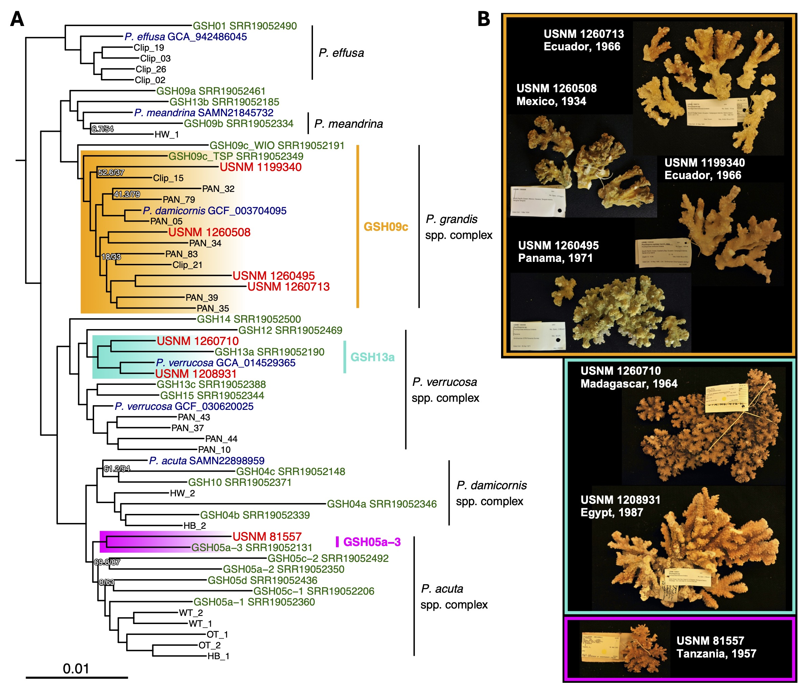

# pocillopora_hDNA_uces

This repository holds the data and code for analysis of historical DNA (hDNA) sequenced from dried *Pocillopora* corals in the Smithsonian National Museum of Natural History dry collections. The manuscript detailing the results of these experiments is now published in *Coral Reefs*! 

Please visit: ["Unlocking the treasure trove: leveraging dry coral specimens for museum genomics", Connelly et al. (2024)](https://link.springer.com/article/10.1007/s00338-024-02525-5)

Catalog Number | Origin | Collection Date | Age (years) | UCE loci | GSH | Current Nomenclature |
|--------------|---------|-----------------|-------------|----------|-----|----------------------|
USNM 1199340 | Ecuador | May 19, 1966 | 58 | 799 | GSH09c_TSP | *P. grandis* |
USNM 1260713 | Ecuador | September 21, 1966 | 58 | 795 | GSH09c_TSP | *P. grandis* |
USNM 1208931 | Egypt | June, 1987 | 37 | 1495 | GSH13a | *P. verrucosa* |
USNM 1260710 | Madagascar | October 23, 1964 | 60 | 1173 | GSH13a | *P. verrucosa* |
USNM 1260508 | Mexico | March 1, 1934 | 90 | 1504 | GSH09c_TSP | *P. grandis* |
USNM 1260495 | Panama | April 30, 1971 | 53 | 814 | GSH09c_TSP | *P. grandis* |
USNM 81557 | Tanzania | August 16, 1957 | 67 | 327 | GSH05a-3 | *P. acuta* |

For more information on specimens, visit https://collections.nmnh.si.edu/search/iz/

Raw sequencing reads are available in the NCBI SRA under accessions [PRJNA1075782](https://www.ncbi.nlm.nih.gov/bioproject/PRJNA1075782) for historical specimens and [PRJNA1055517](https://www.ncbi.nlm.nih.gov/bioproject/PRJNA1055517) and [PRJNA1076507](https://www.ncbi.nlm.nih.gov/bioproject/PRJNA1076507) for contemporary samples. 

 

(A) IQ-TREE maximum likelihood phylogenetic tree depicting the placement of NMNH IZ Pocillopora specimens (in red) in the context of publicly available reference genomes (in blue), genomic species hypotheses (GSHs, in green), and contemporary specimens. The tree was constructed with a 50% sample occupancy matrix containing 1,510 UCE loci, 600,934 bp, and 37,584 informative sites, and nodes with <90% bootstrap support are labelled. 
(B) Photographs of NMNH IZ Pocillopora specimens that were successfully sequenced (>300 UCE sequences) and placed onto the ML phylogeny. 
